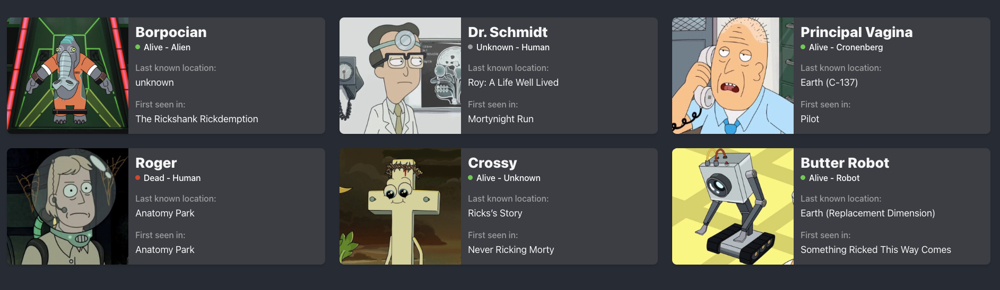

# Parcial Primer Corte Desarrollo Web con React js 🚀


Este parcial consiste en realizar una página web usando únicamente HTML,CSS y JS,
El reto consiste en elaborar la siguiente vista





Para obtener los datos de la vista deberás consumir un API a través de un servicio descrito
en en el archivo [service.js](./src/service.js).


Lo siguiente será acceder al DOM y crear la vista de acuerdo a los descrito en [index.js](./src/index.js),
todos los estilos relacionados al ejercicio deberán estar en el siguiente archivo [index.css](./src/index.css).


Para el desarrollo del ejercicio es indispensable la herramienta [Node Js](https://nodejs.org/es) la cual se debe descargar e instalar.


Para iniciar el proyecto es necesario los siguientes pasos:


### 1) Instalar dependencias:


```
npm install
```


### 2) Compilar la aplicación:


```
npm run build
```


### 3) Correr la aplicación:


```
npm run start
```


Para el desarrollo de este ejercicio deberás bifurcar el repositorio como se indica [aquí](https://docs.github.com/es/get-started/quickstart/fork-a-repo)


Una vez terminado el ejercicio se debe subir a un repositorio creado por ti y agregar esta cuenta [jhonquiceno](https://github.com/jhonquiceno)


como colaborador como se indica [aquí](https://docs.github.com/es/account-and-profile/setting-up-and-managing-your-personal-account-on-github/managing-access-to-your-personal-repositories/inviting-collaborators-to-a-personal-repository)


Se evaluaran los siguientes aspectos:


1. HTML (1 punto)
     * correcto uso de las etiquetas
     * correcto uso de la semántica
     * correcto uso de las propiedades
      
2. CSS (2 puntos)
     * correcto nombramiento de las clases
     * parecido con el diseño requerido
     * responsive design (puntos extra)
       
3. JS (2 puntos)
     * implementación de clases y objetos
     * manejo de las promesas o funciones asíncronas
     * manejo uso de eventos
     * acceso al DOM

